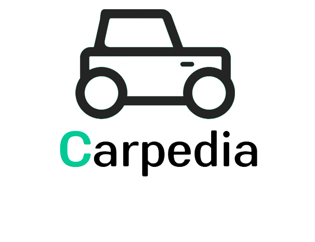

2022-1 OOP Project by Camilo Heras and Omar Plata.

## Getting Started
Code is located inside the src folder. To try out the program, run the `main.py` file. `main.py` must be run from the src directory, otherwise imports and assets won't work correctly and a crash is bound to happen.

## Functional requirements
- [x] The user may want to scroll through a comprehensive list of vehicles
- [x] The user may want to look at price graphs of certain vehicles

## Tasks
- [x] Prevent unexpected program closure
- [x] Show the user information on selected vehicles
- [x] Show the user a price graph on selected vehicles