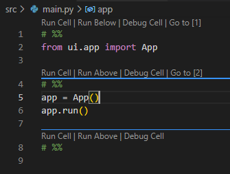
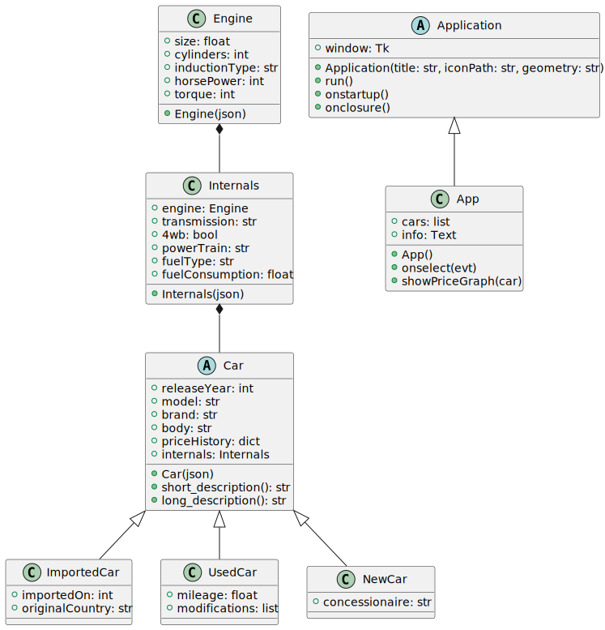

# Carpedia docs
Welcome to the Carpedia docs. This is where the full project is documented, complete with classes, structure, types, and more.

## Available packages
- [tkinterface](tkinterface/README.md)
- [vehicles](vehicles/README.md)

## Project structure
It all starts inside the `src` directory. You'll find three directories and one file inside:

```
src/
├─ assets/
├─ ui/
├─ vehicles/
├─ main.py
```

Let's not worry about the directories for now. Focus on `main.py`. It's an entry point that effectively has only three lines of code:

```Python
from ui.app import App
app = App()
app.run()
```

The code is fairly simple. First line imports the `App` type from the `app` module, next line creates an instance of `App`, last line runs the app. There is no need for extra code in our entry point, as everything else is handled through custom delegates within our `App` class.

### Assets directory
You can see a folder called `assets` inside `src`. This folder contains files that are not code, such as pictures or custom data files:

```
assets/
├─ Cars.json
├─ Icon.ico
├─ Logo.png
```

In our case, we hold a JSON file with the car information, an ICO file that's used for the app's icon, and a PNG file that's used for the main logo.

### What does `# %%` even mean?!
All over our Python source files, you'll find a high amount of lines that are simply `# %%`. These are used for rich Jupyter support within VSCode:



With them, we separate the code in logical regions (imports, class definions, etc). The Python interpreter sees those as simple comments, so the code is not affected.

## Full UML Diagram
Lastly, here's the UML diagram of all the classes in this project:



The [Diagram.puml](uml/Diagram.puml) file contains the full code used to generate the above diagram.