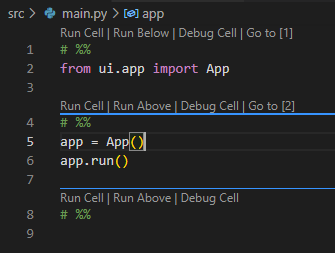
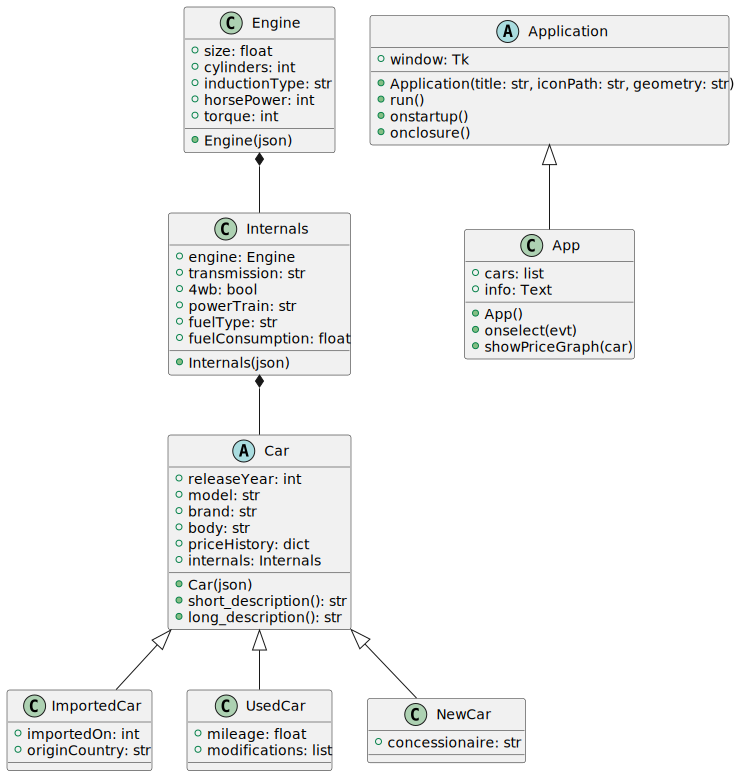

# Carpedia docs
Welcome to the Carpedia docs. This is where the full project is documented, complete with classes, structure, types, and more.

## Available packages
- [tkinterface](tkinterface/README.md)
- [vehicles](vehicles/README.md)

## Project structure
It all starts inside the `src` directory. You'll find three directories and three files inside:

```
src/
├─ carpedia/
├─ tkinterface/
├─ vehicles/
├─ deps.py
├─ main.py
├─ setup.py
```

Let's focus on [main.py](../src/main.py) for now. It's an entry point that effectively has only four lines of code:

```Python
import deps
from carpedia.app import App
app = App()
app.run()
```

The code is fairly simple. First line imports [deps.py](../src/deps.py), which only imports dependencies, and has two lines of code:

```Python
import os
os.system("pip install -e .")
```

This installs all packages available within the working directory, which are signaled by [setup.py](../src/setup.py).

Afterwards, the `App` type is imported from the `carpedia.app` module. The next line creates an instance of `App`, and the last line runs the app. There is no need for extra code in our entry point, as everything else is handled through custom delegates within our `App` class.

### Carpedia directory
You can see a folder called `carpedia` inside `src`. This folder contains the files related to the Carpedia app, which includes the definition of the `App` class and assets:

```
carpedia/
├─ assets/
├─ app.py
```

#### Assets directory
You can see a folder called `assets` inside `carpedia`. This folder contains files that are not code, such as pictures or custom data files:

```
assets/
├─ Cars.json
├─ Icon.ico
├─ Logo.png
```

In our case, we hold a JSON file with the car information, an ICO file that's used for the app's icon, and a PNG file that's used for the main logo.

### What does `# %%` even mean?!
All over our Python source files, you'll find a high amount of lines that are simply `# %%`. These are used for rich Jupyter support within VSCode:



With them, we separate the code in logical regions (imports, class definions, etc). The Python interpreter sees those as simple comments, so the code is not affected.

## Full UML Diagram
Lastly, here's the UML diagram of all the classes in this project:



The [Diagram.puml](assets/Diagram.puml) file contains the full code used to generate the above diagram.